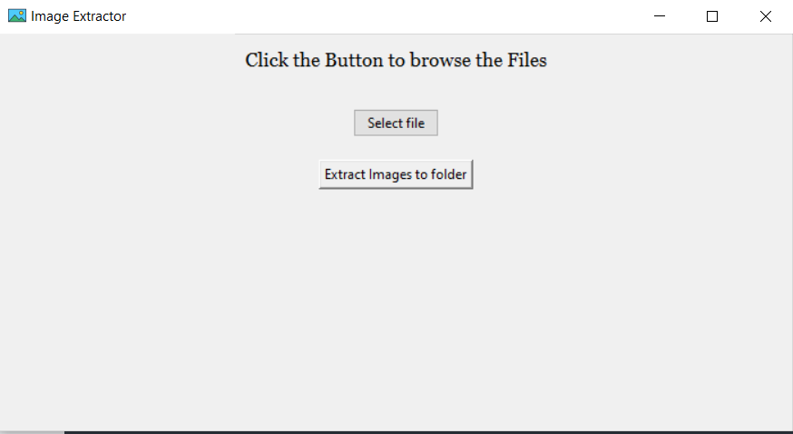

# image_extractor

To install  
===========
```console
pip install - requirements.txt
python3 main.py
```

How to use 
==========
After runing the app
1. Select a pdf
2. click "extract images to folder"

